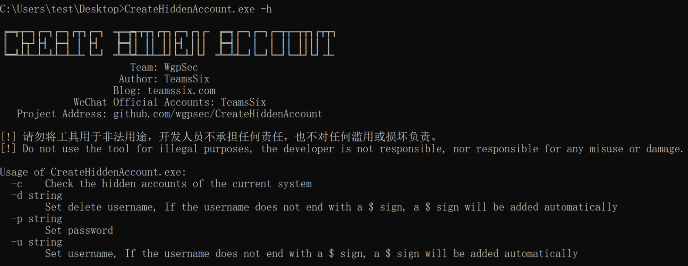
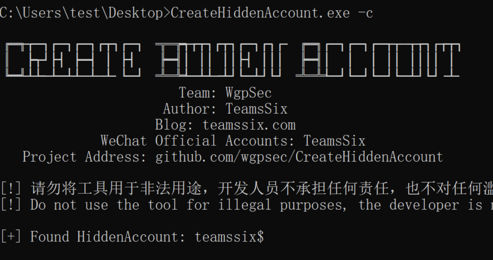
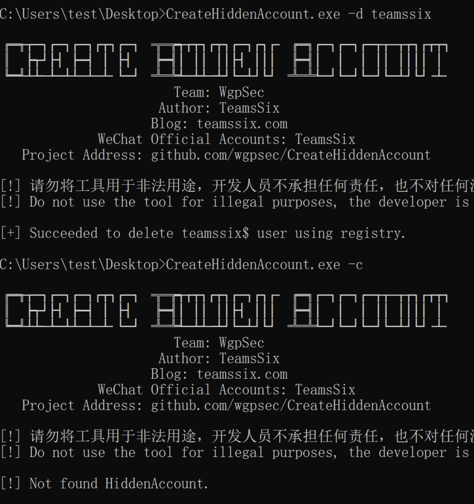

# CreateHiddenAccount 创建隐藏账号


[](https://github.com/wgpsec/CreateHiddenAccount) [](https://github.com/wgpsec/CreateHiddenAccount/issues) [](https://github.com/wgpsec/CreateHiddenAccount/releases)  [](https://github.com/teamssix) [](https://github.com/wgpsec)


[中文](https://github.com/wgpsec/CreateHiddenAccount/blob/master/README_ZH.md) | EN

# Tool Introduction

There are two common ways to create a hidden account. One is to add the $ sign directly after the user name to create it, and the other is to use the registry to clone the user to create. .

So I wondered if I could implement the process of cloning accounts using the registry. After searching on the Internet, I couldn't find a convenient tool, so I wrote one myself.

In addition to adding hidden accounts, the tool also adds functions to check hidden accounts and delete hidden accounts, so that both the red team and the blue team can use this tool.

** DISCLAIMER: DO NOT USE THE TOOL FOR ILLEGAL USE, THE DEVELOPER IS NOT RESPONSIBLE OR RESPONSIBLE FOR ANY MISUSE OR DAMAGE. **

# Download Link

[https://github.com/wgpsec/CreateHiddenAccount/releases](https://github.com/wgpsec/CreateHiddenAccount/releases)

- CreateHiddenAccount.exe           BypassAV works better
- CreateHiddenAccount_upx.exe   Smaller size

# Help Information

Use `CreateHiddenAccount.exe -h` for help

- -c  Check the hidden accounts of the current system
- -d  Set delete username, If the username does not end with a $ sign, a $ sign will be added automatically
- -p  Set password
- -u Set username, If the username does not end with a $ sign, a $ sign will be added automatically



# ✨ Example

Add a hidden account with the user name teamssix, the tool will automatically add the $ character after the user name, so the created user name is teamssix$

When using, remember to run under administrator privileges, otherwise it will prompt insufficient privileges.

```
 CreateHiddenAccount.exe -u teamssix -p Passw0rd
```


Check the hidden accounts of the current system.

```
 CreateHiddenAccount.exe -c
```



Delete the teamssix hidden account. After deleting the account, check the hidden account of the current system again. You can see that there is no hidden account.

```
 CreateHiddenAccount.exe -d teamssix
```



In the end, if there is any bug to open an issue, the Star will be gone, you know.

# ⚠️ Notice

- The tool requires administrator privileges to run

- The tool will automatically add the $ character to the username without the $ character. For example, if -u specifies the user name as teamssix, the actual account added is teamssix$; if -u specifies the user name as teamssix$, then the actual added account is or teamssix$

  >  The purpose of this is because if the user name does not have the $ character, then hiding the user is meaningless. If you just want to add an account, just use net user directly.

- On the domain controller machine, this tool will only add hidden users and will not modify the registry, because on the domain controller machine, user information is not stored in the registry.
