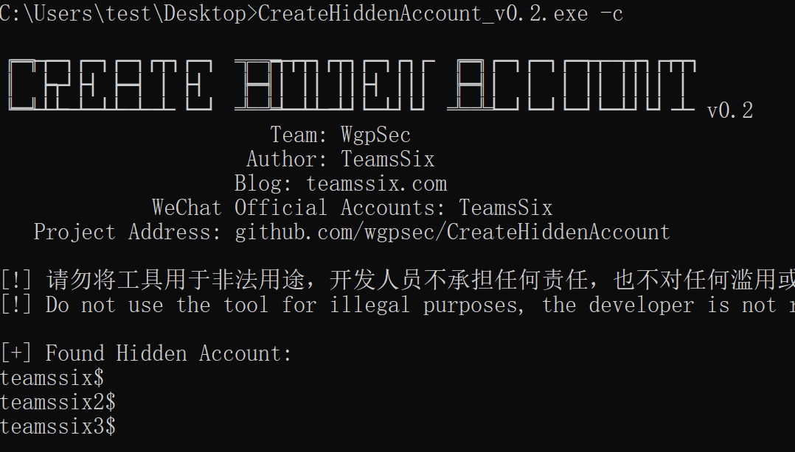
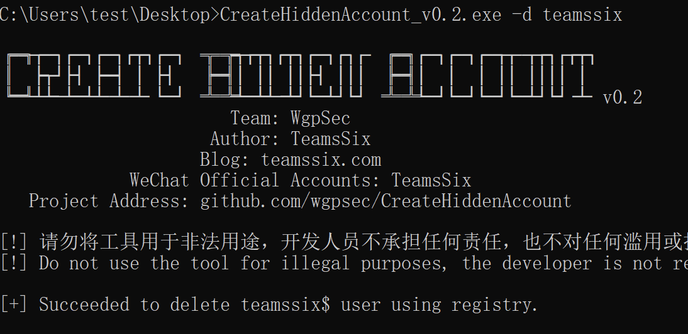

<h1 align="center">CreateHiddenAccount 创建隐藏账号</h1>

[](https://github.com/wgpsec/CreateHiddenAccount) [](https://github.com/wgpsec/CreateHiddenAccount/issues) [](https://github.com/wgpsec/CreateHiddenAccount/releases)  [](https://github.com/teamssix) [](https://github.com/wgpsec)


中文 | [EN](https://github.com/wgpsec/CreateHiddenAccount/)

# 工具介绍

常见的创建隐藏账号的两种方法，一种是直接在用户名后加上 $ 符进行创建，一种是利用注册表克隆用户创建，第二种方法隐藏效果更好些，但是操作要复杂不少。

于是便想着能不能把这个利用注册表克隆账号的过程工具化，在网上搜索了一番后，没有找到顺手的工具，那就自己写一个吧。

工具里除了添加隐藏账号外，还添加了检查隐藏账号、删除隐藏账号的功能，这样不管是红队还是蓝队都可以用到这款工具。

**免责声明：请勿将工具用于非法用途，开发人员不承担任何责任，也不对任何滥用或损坏负责。**

# 下载地址

[https://github.com/wgpsec/CreateHiddenAccount/releases](https://github.com/wgpsec/CreateHiddenAccount/releases)

* CreateHiddenAccount.exe 免杀效果更好
* CreateHiddenAccount_upx.exe 体积更小

# 帮助信息

使用 `CreateHiddenAccount.exe -h` 查看帮助信息

* -c 检查当前系统的隐藏账户
* -cu 设置要克隆的用户，默认 Administrator 用户
* -d 指定要删除的用户名，如果添加的用户名不是以 $ 结尾，则工具会自动在用户名后添加上 $
* -oc 只创建隐藏用户，不对注册表进行操作，避免被杀软拦截
* -p 指定添加的用户的密码
* -u 指定要添加的用户名，如果添加的用户名不是以 $ 结尾，则工具会自动在用户名后添加上 $
* -v 查看当前工具版本


# :sparkles: 示例

添加一个用户名为 teamssix 的隐藏账号，工具会自动在用户名后添加 $ 符，因此创建后的用户名为 teamssix$

使用的时候，记得在管理员权限下运行，不然会提示权限不足

```
CreateHiddenAccount.exe -u teamssix -p Passw0rd
```


指定要克隆的用户名

```
CreateHiddenAccount.exe -u teamssix2 -p Passw0rd -cu test
```


只创建隐藏用户，不修改注册表

```
CreateHiddenAccount.exe -u teamssix3 -p Passw0rd -oc
```


检查当前系统的隐藏账号

```
CreateHiddenAccount.exe -c
```



删除 teamssix 隐藏账号

```
CreateHiddenAccount.exe -d teamssix
```



最后，如果有什么 bug 可以提 issue， Star 就不要了，你懂的。

# ⚠️ 注意事项

* 该工具需要管理员权限才能运行

* 该工具不能保证在 32 位系统下的正常运行

* 在域控机器上，该工具只会添加隐藏用户，不会修改注册表，因为在域控的机器上，用户信息不保存在注册表里。

* 如果控制面板里显示存在隐藏用户，但是工具和 net user 都显示不存在这个用户，那么当电脑重启后，控制面板里的这个隐藏用户就会消失

* 该工具会自动为没有 $ 符的用户名添加上 $ 符，比如 -u 指定用户名为 teamssix，实际上添加的账号是 teamssix$；如果 -u 指定用户名为 teamssix$，那么实际上添加的账号还是 teamssix$

  >  这样做的目的是因为如果用户名没有 $ 符，那么隐藏用户就失去了意义，如果只是想添加个账号，那直接使用 net user 就行。

# 更新记录

## v0.2 2021.1.18

* 增强了隐藏账号检测能力
* 增加了指定克隆用户的功能
* 增加了只创建隐藏用户，不修改注册表的功能
* 增加了工具版本显示

## v0.1 2021.1.17
